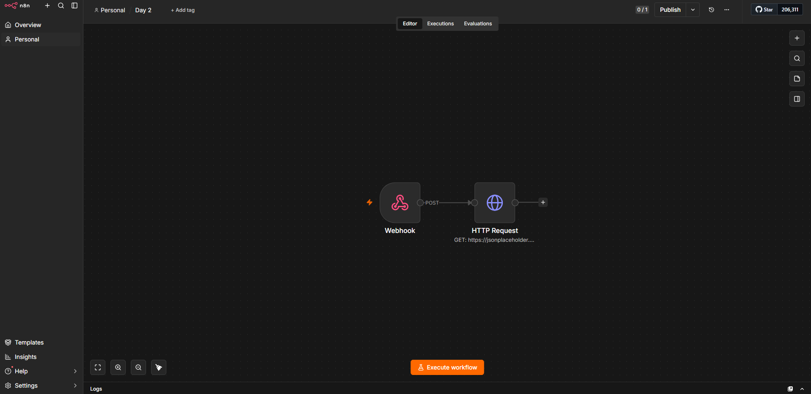
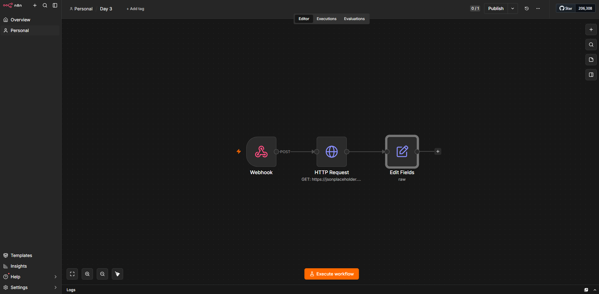
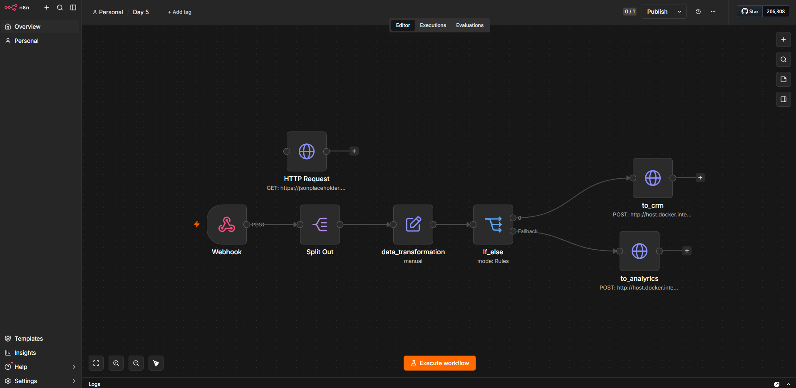

# n8n Workflow Automation Training

**Repository:** [https://github.com/marczydricabraham/n8n-training.git](https://github.com/marczydricabraham/n8n-training.git)

A local, sandboxed n8n training environment paired with an Express/JSON-Server Mock API to build, test, and validate automated end-to-end user ingestion workflows.


## Business problem

> How can we ingest bulk user signup payloads via webhooks, normalize dirty email addresses, and automatically route users to either a CRM or Analytics platform based on corporate vs. public domain criteria?

* Teaches participants to build progressive n8n workflows from basic HTTP requests to complex branching.
* Demonstrates array splitting and data normalization (trimming whitespace and lowercasing email strings).
* Implements conditional routing logic using `Switch` nodes to send corporate signups (`@corporation.com`) to a CRM and public signups to an Analytics platform.

## Repository structure

```text
n8n_training/
├── docker-compose.yml                  # Docker container orchestration setup
├── package.json                        # Dependencies for Express server
├── server.js                           # Express Mock API server implementation
├── db.json                             # Seed database and persistent store
├── documentation/                      # Project documentation & workflow screenshots
│   ├── n8n Training Documentation.md   # Main documentation file
│   ├── workflow_1.png                  # Screenshot for Day 2 workflow
│   ├── workflow_2.png                  # Screenshot for Day 3 workflow
│   └── workflow_3.png                  # Screenshot for Day 5 workflow
├── payloads/                           # Test payload files for webhooks
│   ├── users-corporate-public.json     # 2-user test payload
│   └── users-batch-mix.json            # 4-user mixed domain test payload
├── scripts/                            # Helper scripts for testing and verification
│   ├── send-payload.sh                 # Webhook posting commands
│   └── verify.sh                       # Endpoint verification commands
├── workflows/                          # Exported n8n training workflow JSONs
│   ├── day2.json                       # Webhook to HTTP request flow
│   ├── Day3.json                       # Webhook + HTTP + Edit fields flow
│   └── Day5.json                       # Full end-to-end ingestion & routing flow
└── README.md                           # Setup and training environment guide
```

## Deliverable

The deliverable consists of a local Docker container ecosystem (n8n and Mock API server) and progressive workflow files built across training days.

### Day 2: Webhook & HTTP Integration (`day2.json`)

Demonstrates receiving an incoming POST request via Webhook and forwarding execution to an external REST endpoint (`jsonplaceholder`).



### Day 3: Field Manipulation & Expression Mapping (`Day3.json`)

Receives webhook payloads, calls an external API, and uses an Edit Fields node with expression logic (`trim()`, `toLowerCase()`) to process array items.



### Day 5: End-to-End Automation Canvas (`Day5.json`)

The final production-like pipeline: receives webhooks, splits array items, normalizes data, evaluates corporate domain conditions, and posts to CRM or Analytics endpoints.



## Data sources

* **Webhook Ingestion Point:** Ingests POST requests containing user payload arrays (`/webhook-test/signup-hook`).
* **External Demo API:** Calls `https://jsonplaceholder.typicode.com/users/1` during intermediate workflow steps.
* **Mock API (`db.json`):** Serves as a static local database and simulated destination target for transformed user records.
* **Test Payloads:** Pre-configured JSON files in `payloads/` used to simulate 2-user and 4-user webhook requests.

## Project architecture

```text
Webhook Trigger (/webhook-test/signup-hook)
  └─→ Split Out (body.users)
        └─→ Data Transformation (Trim Whitespace & Lowercase Email)
              └─→ Switch Node (Check for @corporation.com)
                    ├─→ [Corporate Domain] → POST [http://host.docker.internal:3001/crm](http://host.docker.internal:3001/crm)
                    └─→ [Fallback / Other] → POST [http://host.docker.internal:3001/analytics](http://host.docker.internal:3001/analytics)
```
The workflow execution is orchestrated by the n8n Engine container, communicating across containers to the Mock API Server on host port 3001 using host.docker.internal.

## Data model
The system processes incoming payload arrays and persists transformed records to db.json:

**Incoming Webhook Payload (users-corporate-public.json):**

```json
{
  "users": [
    { "name": "Alice Johnson", "email": "ALICE.JOHNSON@Corporation.com" },
    { "name": "Bob Martin", "email": " bob@example.com " }
  ]
}
```

**Transformed & Persisted Output Record:**
```json
{
  "id": "1",
  "clean_email": "alice.johnson@corporation.com",
  "received_at": "2026-08-26T04:56:42.135Z"
}
```

## Technology stack

| Area | Technology |
|---|---|
| Workflow Orchestration | n8n |
| Mock API Server | Node.js , Express, JSON-Server |
| Containerization | Docker |
| Helper Scripts | Bash / Shell Scripts (`scripts/` folder) |
| Storage | `db.json` file-backed database |

## Key engineering features

* **Array Splitting & Item-by-Item Processing:** Uses the `Split Out` node (`body.users`) to break batch JSON arrays into individual item executions.
* **Expression-Based Data Sanitization:** Leverages JS expression syntax (`.trim().toLowerCase()`) inside Set nodes to format incoming email attributes.
* **Conditional Switch Logic:** Employs rule-based string matching (`contains @corporation.com`) with fallback outputs to separate CRM and Analytics targets.
* **Error Handling & Resiliency:** Configures **Retry On Fail** across destination HTTP Request nodes set to **3 max retries** with a **1000ms wait time between tries** to ensure reliable payload delivery against intermittent endpoint failures.
* **Container Cross-Communication:** Configures `host.docker.internal` host bindings for n8n to communicate smoothly with the local Mock API container.
## Output & usage notes

* Corporate signups containing `@corporation.com` are stored at `http://localhost:3001/crm`.
* Non-corporate signups are captured at `http://localhost:3001/analytics`.
* Destination HTTP endpoints utilize automated retry settings (3 retries with 1000ms delay) to prevent dropped data on connection timeouts or temporary network glitches.
* *Note:* Activate the workflow in n8n or click "Listen for test event" on the Webhook node before sending test payloads.

## Getting started

### Prerequisites

* Docker Desktop
* Terminal / CLI with cURL installed
* Available host ports: `5678` and `3001`

### Local setup

1. Spin up the container environment:

```bash
docker compose up -d
```

2. Check container status:

```bash
docker compose ps
```

3. Access n8n at `http://localhost:5678` and register your account.

### Data setup

1. In n8n, import any of the workflow JSON files from the `workflows/` directory (`Day2.json`, `Day3.json`, or `Day5.json`).
2. Execute test payloads using the commands in `scripts/send-payload.sh`:

```bash
curl -X POST http://localhost:5678/webhook-test/signup-hook \
  -H "Content-Type: application/json" \
  -d @payloads/users-corporate-public.json
```

3. Verify records using commands in `scripts/verify.sh`:

```bash
# Verify CRM endpoint
curl http://localhost:3001/crm

# Verify Analytics endpoint
curl http://localhost:3001/analytics
```
